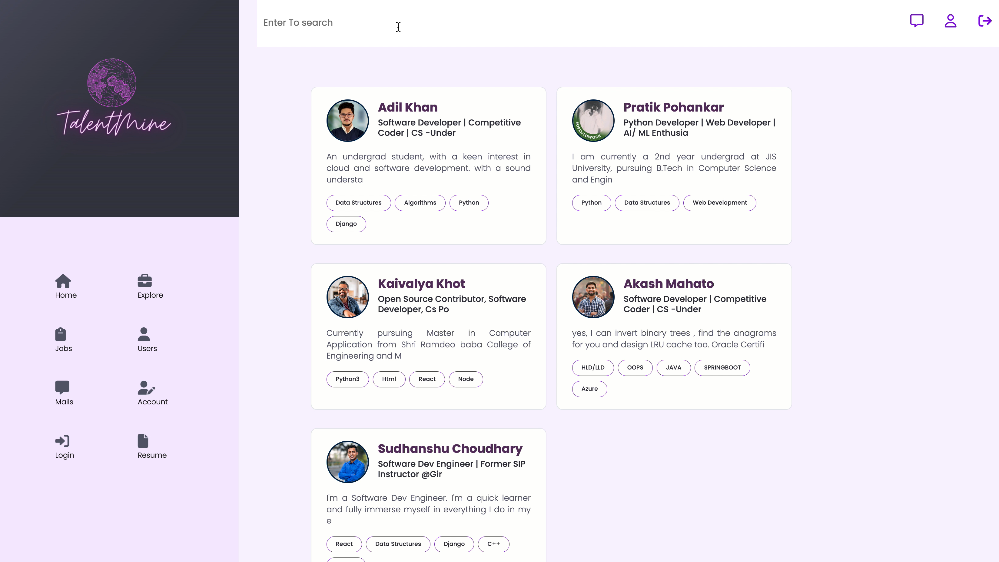
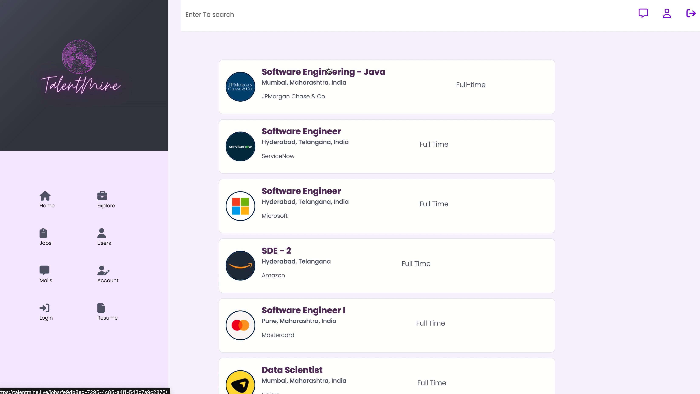
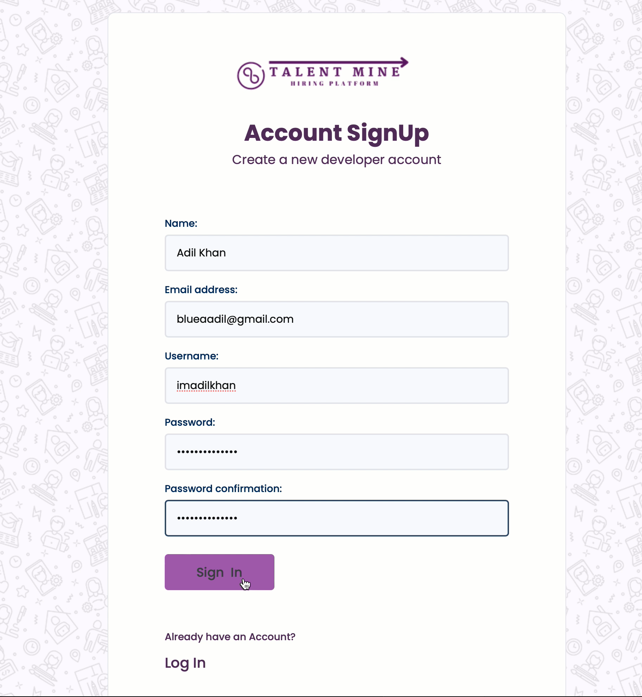

# TalentMine

 *TalentMine Is A Recruiting Solution Provider* 
 *TalentMine Is a web app where Users can find and post a job, hire or get hired, review other people’s work
and chat*
 
_following are the techonlogies used_
 
 * Django.
 * JavaScript.
 * PostGress.
 * AWS.
 

 
 
 
 _ Steps to use this project_
 
 * Download the repository
 * type:- pip install requirements
 * type:- python manage.py makemigrations
 * type:- python manage.py migrate
 * type:- python manage.py runserver
 * website will launch on port 8000
